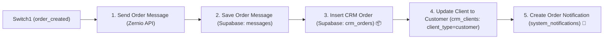
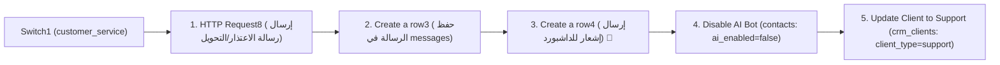

# دليل تطبيق وتحديث ورك فلو n8n (n8n Workflow Guide)

هذا الدليل يشرح لك خطوة بخطوة كل ما تحتاجه لتطبيق الميزات الجديدة (مؤشر الكتابة Typing Indicator عبر Zernio، توفير الـ Tokens عبر الـ JSON الذكي، مسار إنشاء الطلبات وحفظها في جدول `crm_orders`، مسار خدمة العملاء مع الإشعارات، وتراكم وحفظ الـ Tags في `crm_clients` مع الحفاظ على حالة العميل) داخل منصة **n8n**.

---

## 📑 فهرس المسارات والخطوات

1. [الخطوة 1: مؤشر الكتابة (Typing Indicator) عبر Zernio](#1-الخطوة-1-إضافة-مؤشر-الكتابة-typing-indicator)
2. [الخطوة 2: تحديث الـ System Prompt في عقدة AI Agent](#2-الخطوة-2-تحديث-الـ-system-prompt)
3. [الخطوة 3: كود عقدة المعالجة الذكية (Code in JavaScript2)](#3-الخطوة-3-كود-عقدة-المعالجة-الذكية-code-in-javascript2)
4. [الخطوة 4: توجيه مسارات الـ Switch (Switch1 Routing)](#4-الخطوة-4-توجيه-مسارات-الـ-switch)
5. [الخطوة 5: مسار إنشاء الطلب وحفظه في الداشبورد (Order Creation Route)](#5-الخطوة-5-مسار-إنشاء-الطلب-وحفظه-في-الداشبورد-order_created) 🛒
6. [الخطوة 6: مسار خدمة العملاء وإيقاف الرد الآلي (Customer Service & Escalation)](#6-الخطوة-6-مسار-خدمة-العملاء-وإيقاف-الرد-الآلي) 🚨
7. [الخطوة 7: حفظ وتراكم الكاتجوريز (Tags) عبر Supabase RPC دالة واحدة](#7-الخطوة-7-حفظ-وتراكم-الكاتجوريز-tags-عبر-supabase-rpc) 🏷️

---

## 1. الخطوة 1: إضافة مؤشر الكتابة (Typing Indicator)

* **Node Type:** `HTTP Request`
* **Method:** `POST`
* **URL:**
  ```text
  https://api.zernio.com/v1/inbox/conversations/{{ $('Webhook').first().json.body.conversation.id }}/typing
  ```
* **Headers:**
  * `Authorization`: `Bearer YOUR_ZERNIO_API_KEY`
  * `Content-Type`: `application/json`
* **Body (JSON):**
  ```json
  {
    "accountId": "={{ $('Webhook').item.json.body.account.accountId }}"
  }
  ```

---

## 2. الخطوة 2: تحديث الـ System Prompt

قم بنسخ محتوى البرومبت المحدث فائق التوفير من:
📄 **[system_message.txt](file:///c:/Users/LOQ/Desktop/CLI/emirates%20mostafa/woocommerce/bot-dashboard/system_message.txt)** والصقه في عقدة `AI Agent`.

---

## 3. الخطوة 3: كود عقدة المعالجة الذكية (Code in JavaScript2)

افتح عقدة **`Code in JavaScript2`** والصق هذا الكود المحصن (يحافظ على حالة العميل ولا يعيدها لـ `new` عند المحادثات العادية):

```javascript
// ============================================================================
// Parse AI Agent Output — Ultra-Compact Schema
// Automatically infers missing keys and maps client_status smartly
// ============================================================================

const VALID_INTENTS = [
  'conversation',
  'product_details',
  'complaint',
  'customer_service',
  'order_created',
];

const VALID_CATEGORIES = [
  'Computers & Computing',
  'Printers & Scanners',
  'Ink, Toner & Printing Supplies',
  'Networking & Connectivity',
  'CCTV & Surveillance',
  'Access Control Systems',
  'Security & Alarm Systems',
  'IP Telephony & Communication',
  'Time Attendance & Biometric Systems',
  'Power & Electrical Protection',
  'Storage & Backup',
];

const VALID_CLIENT_STATUSES = [
  'new',
  'interested',
  'customer',
  'repeat_customer',
  'support',
  'inactive',
];

const FALLBACK_REPLY = 'أهلاً بك 🙏 كيف أقدر أساعدك اليوم في منتجات وخدمات آي كونكت؟';

function ok(intent, reply, extra = {}, parseNote = 'ok') {
  return [{
    json: {
      intent,
      reply: reply || FALLBACK_REPLY,
      product_id: extra.product_id ?? null,
      complaint: extra.complaint ?? null,
      order: extra.order ?? null,
      detected_category: extra.detected_category ?? null,
      category: extra.detected_category ?? null,
      client_status: extra.client_status ?? null,
      _parse: parseNote,
    },
  }];
}

// 0. استلام مخرج الـ Agent
const input = $input.first().json;
const raw = input.output ?? input.text ?? input.response ?? '';

if (!raw || typeof raw !== 'string') {
  return ok('conversation', FALLBACK_REPLY, {}, 'no-output-field');
}

// 1. استخراج الـ JSON من Code Block أو أقواس {}
let jsonString = null;
const fence = raw.match(/```{3,}(?:json)?\s*([\s\S]*?)\s*```{3,}/);
if (fence && fence[1]) jsonString = fence[1].trim();

if (!jsonString) {
  const start = raw.indexOf('{');
  const end = raw.lastIndexOf('}');
  if (start > -1 && end > start) jsonString = raw.slice(start, end + 1).trim();
}

if (!jsonString) {
  return ok('conversation', raw.trim(), {}, 'plain-text-fallback');
}

// 2. عمل Parse مع معالجة الأسطر الجديدة
let parsed = null;
try {
  parsed = JSON.parse(jsonString);
} catch (e) {
  try {
    parsed = JSON.parse(
      jsonString.replace(/\n/g, '\\n').replace(/\r/g, '\\r').replace(/\t/g, '\\t')
    );
  } catch (e2) {
    return ok('conversation', raw.trim(), {}, 'parse-failed');
  }
}

if (!parsed || typeof parsed !== 'object' || Array.isArray(parsed)) {
  return ok('conversation', raw.trim(), {}, 'not-an-object');
}

// 3. تطبيع الحقول
let intent = typeof parsed.intent === 'string' ? parsed.intent.trim() : '';
let note = 'ok';

if (!VALID_INTENTS.includes(intent)) {
  note = `unknown-intent:${intent || 'empty'}`;
  intent = 'conversation';
}

let reply = parsed.reply ?? parsed.botResponse ?? parsed.response ?? '';
if (typeof reply !== 'string' || !reply.trim()) {
  reply = raw.trim() || FALLBACK_REPLY;
  note = 'missing-reply';
}
reply = reply.trim();

let productId = null;
if (parsed.product_id !== null && parsed.product_id !== undefined) {
  const n = Number(parsed.product_id);
  if (Number.isFinite(n) && n > 0) productId = Math.trunc(n);
}

const complaint =
  typeof parsed.complaint === 'string' && parsed.complaint.trim()
    ? parsed.complaint.trim()
    : null;

const order =
  parsed.order && typeof parsed.order === 'object' && !Array.isArray(parsed.order)
    ? parsed.order
    : null;

// مطابقة الكاتجوري (يدعم category أو detected_category)
const rawCategory = parsed.category ?? parsed.detected_category ?? null;
let detectedCategory = null;
if (typeof rawCategory === 'string' && rawCategory.trim()) {
  const trimmed = rawCategory.trim();
  const matched = VALID_CATEGORIES.find(c => c.toLowerCase() === trimmed.toLowerCase());
  if (matched) detectedCategory = matched;
}

// استنتاج حالة العميل تلقائياً فقط عند حدوث تغيير حقيقي، وإلا تظل null حتى لا نغير حالته الحالية
let clientStatus = null;
if (typeof parsed.client_status === 'string' && parsed.client_status.trim()) {
  const s = parsed.client_status.trim().toLowerCase();
  if (VALID_CLIENT_STATUSES.includes(s)) clientStatus = s;
} else {
  // الاستنتاج التلقائي فقط عند أحداث محددة
  if (detectedCategory || intent === 'product_details') clientStatus = 'interested';
  else if (intent === 'order_created') clientStatus = 'customer';
  else if (intent === 'complaint' || intent === 'customer_service') clientStatus = 'support';
  else clientStatus = null; // يظل null في الكلام العادي والتحيات للحفاظ على حالة العميل الحالية في الداتابيز
}

// حراس الأمان (Guards)
if (intent === 'product_details' && productId === null) {
  return ok('conversation', reply, { detected_category: detectedCategory, client_status: clientStatus }, 'product_details-without-product_id');
}

if (intent === 'complaint' && !complaint) {
  return ok('complaint', reply, { complaint: reply, detected_category: detectedCategory, client_status: 'support' }, 'complaint-body-defaulted');
}

if (intent === 'order_created' && (!order || !order.order_number)) {
  return ok('conversation', reply, { detected_category: detectedCategory, client_status: clientStatus }, 'order_created-without-order');
}

return ok(intent, reply, {
  product_id: productId,
  complaint,
  order,
  detected_category: detectedCategory,
  client_status: clientStatus,
}, note);
```

---

## 4. الخطوة 4: توجيه مسارات الـ Switch (Switch1 Routing)

تأكد من وجود المسارات الأربعة في **`Switch1`**:

* **Output 0 (`conversation`):** المحادثة العادية والردود السريعة.
* **Output 1 (`product_details`):** إرسال صور ومواصفات المنتج تلقائياً.
* **Output 2 (`order_created`):** إرسال رابط الدفع، تسجيل الطلب في `crm_orders`، وتحديث العميل إلى Customer.
* **Output 3 (`customer_service` / `complaint`):** إيقاف البوت والتحويل لخدمة العملاء وتنبيه الداشبورد.

---

## 5. الخطوة 5: مسار إنشاء الطلب وحفظه في الداشبورد (`order_created`) 🛒

عندما يخرج الـ Intent كـ **`order_created`** (المسار 2 من `Switch1`):



### 1. إرسال رسالة الطلب ورابط الدفع للعميل (`Send Order Message`):
* **Node Type:** `HTTP Request` $\rightarrow$ `POST` إلى Zernio Messages
* **Message:** `={{ $('Switch1').item.json.reply }}`

### 2. حفظ الرسالة في جدول الرسائل (`Save Order Message`):
* **Node Type:** `Supabase` $\rightarrow$ `Create a row` على جدول `messages` مع `sender_type: 'ai'`.

### 3. تسجيل الطلب في الداشبورد (`Insert CRM Order`):
* **Node Type:** `Supabase` $\rightarrow$ `Create a row` على جدول `crm_orders`
* **Fields Values:**
  * `organization_id` = `={{ $('Edit Fields12').item.json.organization_id }}`
  * `client_id` = `={{ $('Edit Fields4').item.json.contact_uuid }}`
  * `order_number` = `={{ $('Code in JavaScript2').item.json.order?.order_number }}`
  * `ecommerce_order_id` = `={{ $('Code in JavaScript2').item.json.order?.order_id || $('Code in JavaScript2').item.json.order?.order_number }}`
  * `total` = `={{ parseFloat($('Code in JavaScript2').item.json.order?.total || 0) }}`
  * `currency` = `SAR`
  * `status` = `pending`
  * `order_date` = `={{ DateTime.now().toISO() }}`

### 4. ترقية حالة العميل إلى مشتري (`Update Client to Customer`):
* **Node Type:** `Supabase` $\rightarrow$ `Update` على جدول `crm_clients`
* **Filter:** `contact_id` **eq** `={{ $('Edit Fields4').item.json.contact_uuid }}`
* **Field:** `client_type` = `customer`

### 5. إرسال إشعار فوري للداشبورد بالطلب الجديد (`Create Order Notification`):
* **Node Type:** `Supabase` $\rightarrow$ `Create a row` على جدول `system_notifications`
* **Fields:**
  * `organization_id` = `={{ $('Edit Fields12').item.json.organization_id }}`
  * `type` = `order_created`
  * `title` = `=🛒 طلب جديد: {{ $('Code in JavaScript6').item.json.SenderName || 'عميل' }}`
  * `message` = `=تم إنشاء طلب شراء جديد بقيمة {{ $('Code in JavaScript2').item.json.order?.total || '—' }} ريال (رقم الطلب #{{ $('Code in JavaScript2').item.json.order?.order_number || '—' }})`
  * `client_id` = `={{ $('Edit Fields4').item.json.contact_uuid }}`
  * `is_read` = `false`

---

## 6. الخطوة 6: مسار خدمة العملاء وإيقاف الرد الآلي 🚨

عندما يخرج الـ Intent كـ **`customer_service` / `complaint`** (المسار 3 من `Switch1`):



### 1. إرسال رسالة التحويل للعميل (`HTTP Request8`):
* **Node Type:** `HTTP Request` $\rightarrow$ `POST` إلى Zernio Messages endpoint.

### 2. حفظ الرسالة في جدول الرسائل (`Create a row3`):
* **Node Type:** `Supabase` $\rightarrow$ `Create a row` على جدول `messages` مع `sender_type: 'ai'`.

### 3. إرسال التنبيه اللحظي للداشبورد (`Create a row4`):
* **Node Type:** `Supabase` $\rightarrow$ `Create a row` على جدول `system_notifications`
* **Type:** `customer_service`
* **Title:** `=🚨 طلب خدمة عملاء: {{ $('Code in JavaScript6').item.json.SenderName || 'عميل' }}`
* **Message:** `={{ $('Code in JavaScript2').item.json.complaint || 'طلب تحويل لموظف بشري / استفسار خاص' }}`
* **Client ID:** `={{ $('Edit Fields4').item.json.contact_uuid }}`
* **Organization ID:** `={{ $('Edit Fields12').item.json.organization_id }}`
* **Is Read:** `false`

### 4. إيقاف الرد الآلي للعميل (`Disable AI Bot`):
* **Node Type:** `Supabase` $\rightarrow$ `Update` على جدول `contacts` $\rightarrow$ `ai_enabled = false`.

### 5. تحديث حالة العميل إلى Support (`Update Client to Support`):
* **Node Type:** `Supabase` $\rightarrow$ `Update` على جدول `crm_clients` $\rightarrow$ `client_type = 'support'`.

---

## 7. الخطوة 7: حفظ وتراكم الكاتجوريز (Tags) عبر Supabase RPC 🏷️

في مسار الرد العادي (`conversation` و `product_details`)، بعد حفظ الرسالة في `messages` (`Create a row`):

* **Node Name:** `HTTP Request10`
* **Node Type:** `HTTP Request`
* **Method:** `POST`
* **URL:**
  ```text
  https://uorfbqhsaxoofzqouqsj.supabase.co/rest/v1/rpc/append_client_category
  ```
* **Authentication:** `Predefined Credential Type` $\rightarrow$ `Supabase API` $\rightarrow$ `Supabase account`
* **Send Body:** `ON`
* **Body (JSON):**
  ```json
  {
    "p_contact_id": "={{ $('Edit Fields4').item.json.contact_uuid }}",
    "p_category": "={{ $('Code in JavaScript2').item.json.category }}",
    "p_client_status": "={{ $('Code in JavaScript2').item.json.client_status }}"
  }
  ```
